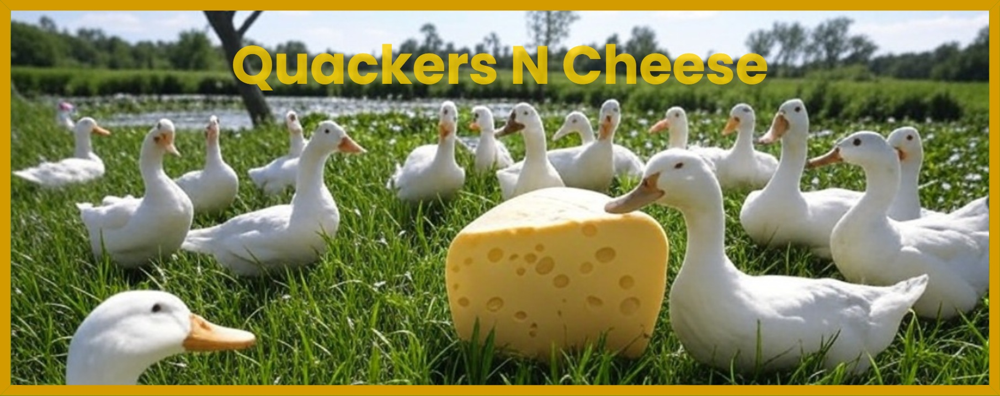

# Greetings, I'm Quackers! 
I want to learn Web Development! 
- 🔭 I'm currently learning HTML, CSS, and JavaScript with:  

 

- 📫 How to reach me [quackersncheese1024@gmail.com](mailto:quackersncheese1024@gmail.com)
- 🌐 I share my learning journey on my [Website](https://quackersncheese.github.io/QuackersNCheese/)  
I hang out in the [MLH Server](https://discord.gg/mlh) on Discord a lot 
   

## Languages and Tools:

<!--

-->

<!--

-->
